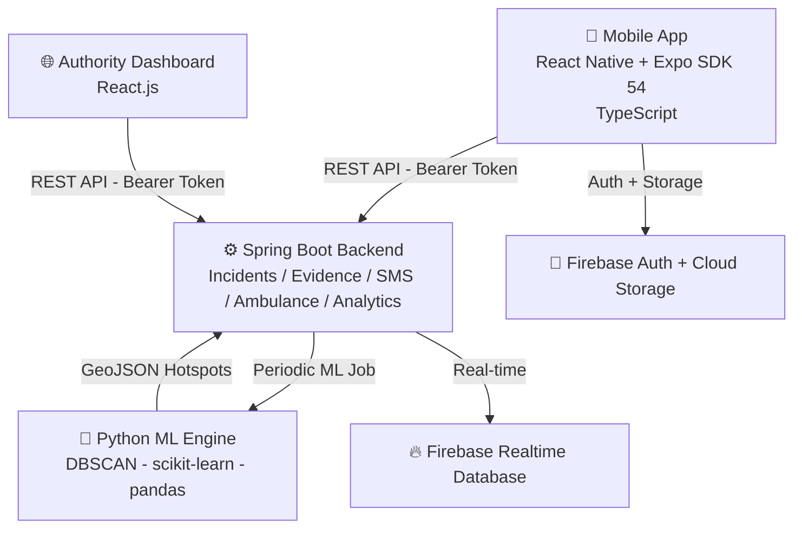

# AlertMe 🚨

### A Smart Emergency Assistance and Predictive Accident Zone Alert System for Sri Lanka


---

## 📖 About

**AlertMe** is a cross-platform emergency assistance platform designed for Sri Lankan citizens. Sri Lanka records over 28,000 road accidents annually, yet no unified digital platform exists to automate incident reporting, share GPS evidence, or give real-time visibility of emergency resources. AlertMe addresses this gap.

The system enables citizens to send one-gesture SOS alerts with automatic GPS capture, report accidents with multimedia evidence, and track dispatched ambulances in real time — all with offline-first support and bilingual (English/Sinhala) UI.

On the authority side, emergency dispatchers access a React.js web dashboard showing a live incident feed, ambulance fleet status, and a predictive accident risk map generated by a Python DBSCAN machine-learning engine.

> **Final Year Individual Computing Project** — BSc (Hons) Software Engineering
> NSBM Green University (in partnership with Plymouth University)

---

## 🏗️ System Architecture

AlertMe is built as a **four-component platform**:



---

## ✨ Features

### 📱 Mobile App (Citizen-Facing)

- 🆘 **One-Gesture SOS Alert** — Sustained press triggers alert with automatic GPS capture and emergency contact SMS notification
- 📍 **Accident Reporting** — Four-step wizard with photo, video, and audio evidence upload
- 🚑 **Live Ambulance Tracking** — Real-time ambulance position on map with route polyline and ETA
- 👤 **Medical Profile** — Personal medical info attached to SOS alerts for responders
- 📞 **Emergency Contacts** — Manage and auto-notify trusted contacts on SOS trigger
- 📶 **Offline-First** — Reports queued locally via AsyncStorage when offline, auto-synced on reconnection
- 🌐 **Bilingual UI** — Full English and Sinhala language support
- 🔐 **Phone OTP Auth** — Firebase Phone Authentication with reCAPTCHA, no email required
- 📋 **Incident History** — View status updates on past reports

### 🌐 Authority Web Dashboard

- 🗺️ **Live Incident Map** — Real-time feed of active incidents with GPS markers and side panel
- 🚒 **Ambulance Fleet Management** — View, dispatch, and recall units with smart "Best Fit" recommendations
- 📹 **Tactical Video HUD** — Live stream viewer per incident
- 📊 **Analytics Dashboard** — Usage trends, incident type breakdowns, and response metrics
- 🔥 **Predictive Risk Map** — DBSCAN-generated accident hotspot overlays (GeoJSON polygons)
- 📂 **Incident Details** — Full multimedia evidence viewer per incident
- 📅 **Historical Records** — Browse past incident data with filters

### 🤖 ML Analytics Engine

- Processes historical incident records from the Spring Boot backend
- Applies **DBSCAN clustering** weighted by incident severity, recency (exponential decay), and type
- Generates GeoJSON accident hotspot cluster boundaries
- Writes results back to the backend for dashboard risk map visualization

---

## 🛠️ Technology Stack

| Layer | Technology | Version |
|---|---|---|
| Mobile App | React Native | 0.81.5 |
| Mobile Toolchain | Expo SDK | 54 |
| Language | TypeScript | 5.9 (strict) |
| Navigation | React Navigation | v7 |
| Auth | Firebase Authentication (Phone OTP) | v12 |
| Real-time | Firebase Realtime Database | v12 |
| HTTP Client | Axios | v1.13 |
| Maps | react-native-maps (Google Maps) | v1.20 |
| Offline Storage | AsyncStorage | v2.2 |
| Audio | expo-av | v16 |
| Media | expo-image-picker | v17 |
| Location | expo-location | v19 |
| i18n | i18n-js (English + Sinhala) | v4.5 |
| Web Dashboard | React.js + Vite | 18.x |
| Backend | Spring Boot (Java) | 3.x |
| ML Engine | Python + scikit-learn + pandas | 3.11 / 1.4 |
| State Management | React Context + AsyncStorage | — |

---

## 📂 Project Structure

```
AlertMe/
├── AlertMeMobile/
│   ├── assets/
│   ├── components/
│   ├── constants/
│   ├── hooks/
│   ├── scripts/
│   ├── src/
│   │   ├── components/
│   │   ├── context/
│   │   ├── i18n/
│   │   ├── navigation/
│   │   ├── screens/
│   │   ├── services/
│   │   └── utils/
│   ├── App.tsx
│   ├── app.json
│   └── tsconfig.json
│
├── alertme-dashboard/
│   └── src/
│       ├── components/
│       ├── layouts/
│       ├── pages/
│       └── services/
│
├── backend/
│   └── src/main/java/com/alertme/backend/
│       ├── config/
│       ├── controller/
│       ├── dto/
│       ├── exception/
│       ├── model/
│       ├── repository/
│       ├── security/
│       └── service/
│
├── ml_service/
├── start-backend.ps1
└── stop-backend.ps1
```

---

## 🚀 Getting Started

### Prerequisites

- Node.js 18+
- Expo CLI — `npm install -g expo-cli`
- Java 17+
- Python 3.11+
- Firebase project with Phone Authentication enabled
- Android device or emulator (Android 13+ recommended)

### 1. Mobile App

```bash
cd AlertMeMobile
npm install
npx expo start
```

### 2. Backend

```bash
cd backend
./mvnw spring-boot:run
```

### 3. Authority Dashboard

```bash
cd alertme-dashboard
npm install
npm run dev
```

### 4. ML Analytics Engine

```bash
cd ml_service
pip install -r requirements.txt
python main.py
```

---

## 🔐 Security

- Firebase Phone OTP Authentication with reCAPTCHA
- Firebase ID Token as Bearer token on all backend API endpoints
- Firebase Security Rules for Realtime Database access control
- Role-based access (Citizen / Dispatcher / Admin)
- Firebase Cloud Storage for secure multimedia evidence

---

## 🧪 Testing

- **Functional Testing** — 83 test cases across 12 modules, all passed on a physical Android 13 device
- **Offline Testing** — SOS and report queuing verified under no-network conditions
- **ML Engine Testing** — DBSCAN cluster boundaries validated against simulated historical incident data
- **Heuristic Evaluation** — Nielsen's 10 Usability Heuristics applied; average severity score 1.8/4.0

---

## 🎯 Project Objectives

| Objective | Status |
|---|---|
| Cross-platform mobile app with one-gesture SOS + GPS capture | ✅ Met |
| Phone OTP authentication via Firebase with reCAPTCHA | ✅ Met |
| Multimedia accident reporting (photo, video, audio) | ✅ Met |
| Real-time ambulance tracking interface with ETA | ⚠️ Partially Met |
| DBSCAN predictive accident zone analytics engine | ✅ Met |
| Authority React.js web dashboard with incident map & risk overlays | ✅ Met |
| Offline-first architecture with automatic background sync | ✅ Met |

---

## 🔮 Future Work

The following features currently run in simulation mode and are prioritised for production:

### 🔴 High Priority

- **Real SMS Notifications**
  - The `SmsController` currently logs to console without delivering a real message
  - Integrate **Twilio SMS** or **Dialog Ideamart API** into the existing `SmsService`
  - Estimated effort: ~0.5 days

- **Real Ambulance GPS Tracking**
  - Currently uses a fixed-step position simulation on both the dashboard and mobile tracking screen
  - Use `expo-location` `watchPositionAsync()` on the driver's device, write coordinates to **Firebase Realtime Database** every few seconds, subscribe via `onValue` listeners on both ends
  - Estimated effort: 3–5 days

### 🟡 Medium Priority

- **Real Secure Chat (Dispatcher ↔ Reporter)**
  - Currently a fixed auto-reply bot with no real message exchange
  - Write messages to `firebase_rtdb/chats/{incidentId}/messages`, subscribe via `onValue` listeners — no new backend infrastructure needed
  - Estimated effort: 1–2 days

- **Real Incident Timeline Timestamps**
  - Currently shows fixed offsets rather than real event times
  - Add `arrived_at`, `on_scene_at`, `transporting_at` columns to `dispatch_logs` and record actual timestamps at each status transition
  - Estimated effort: ~1 day

- **Real Ambulance Route Animation**
  - Currently the marker moves in a straight diagonal line
  - Use the already-loaded **Google Maps Directions API** — one `DirectionsService.route()` call on `TRANSPORTING` status to animate along the real road path
  - Estimated effort: ~1 day

### 🟢 Lower Priority

- **Real Voice Call (Dispatcher ↔ Reporter)**
  - Currently simulates ringing with no real audio
  - Integrate **Twilio Programmable Voice** to dial the reporter's registered number from the backend
  - Estimated effort: 2–3 days

- **Real Live Video Stream (Reporter → Dashboard)**
  - Currently writes a Firebase flag rather than transmitting real frames
  - Use **Agora.io WebRTC** — mobile joins as broadcaster, dashboard joins as audience using `incidentId` as the channel name
  - Estimated effort: 3–5 days

- **Live DBSCAN Risk Map Recomputation**
  - The "Run Prediction" button adds a cosmetic delay without real computation
  - Add `POST /analytics/risk-clusters/recompute` to Spring Boot backend, trigger `analyticsService.runDbscanClustering()`, refresh map on completion
  - Estimated effort: ~1 day

- **Tamil Language Support** — Add a Tamil locale to the existing `i18n-js` setup

- **Formal Accessibility & Security Audit** — Screen reader support, colour contrast review, and penetration testing before any production deployment

---

## 👤 Author

**Gal A. Senarathna**
BSc (Hons) Software Engineering
NSBM Green University, Sri Lanka

---

*Built to help Sri Lankan citizens reach emergency services faster — because every second counts. 🚨*
